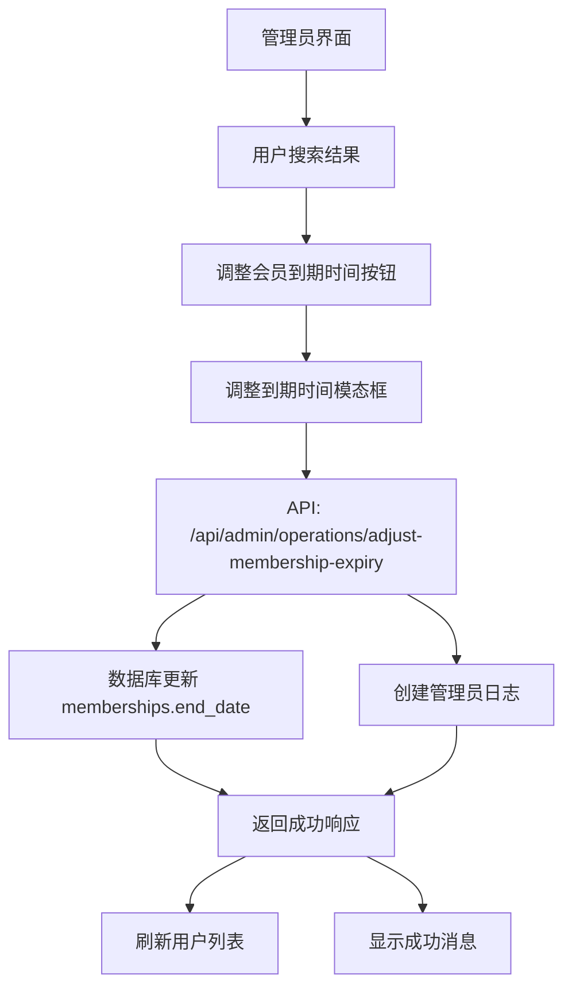

# 设计文档

## 概述

管理员会员到期时间调整功能将集成到现有的管理员后台用户管理界面中。该功能允许管理员手动修改用户的会员到期时间，主要用于测试会员到期后的积分重置功能。设计将遵循现有的管理员操作模式，包括API路由、数据库操作和日志记录。

## 架构

### 系统架构图



### 数据流

1. 管理员在用户管理界面搜索用户
2. 点击用户的"调整会员到期时间"按钮
3. 打开模态框显示当前会员信息和日期选择器
4. 管理员选择新的到期日期并提交
5. 前端发送请求到 `/api/admin/operations/adjust-membership-expiry`
6. 后端验证数据并更新数据库
7. 记录管理员操作日志
8. 返回成功响应并刷新界面

## 组件和接口

### 前端组件

#### 1. 调整会员到期时间按钮
- **位置**: 用户搜索结果列表中每个用户的操作按钮区域
- **样式**: 与现有的"快速设置会员"按钮保持一致
- **图标**: Clock 图标
- **文本**: "调整到期时间"

#### 2. 调整到期时间模态框
- **组件名**: `AdjustMembershipExpiryModal`
- **状态管理**:
  ```typescript
  const [showAdjustExpiryModal, setShowAdjustExpiryModal] = useState(false)
  const [selectedUserForExpiry, setSelectedUserForExpiry] = useState<User | null>(null)
  const [expiryForm, setExpiryForm] = useState({
    newExpiryDate: '',
    reason: ''
  })
  ```

#### 3. 模态框内容结构
```typescript
interface AdjustExpiryModalProps {
  user: User
  isOpen: boolean
  onClose: () => void
  onSuccess: () => void
}
```

### API 接口

#### 调整会员到期时间 API
- **路径**: `/api/admin/operations/adjust-membership-expiry`
- **方法**: POST
- **请求体**:
  ```typescript
  interface AdjustMembershipExpiryRequest {
    user_id: string
    new_expiry_date: string // ISO 8601 格式: YYYY-MM-DDTHH:mm:ss
    reason?: string
  }
  ```
- **响应**:
  ```typescript
  interface AdjustMembershipExpiryResponse {
    success: boolean
    message: string
    data?: {
      old_expiry_date: string
      new_expiry_date: string
      user_email: string
    }
  }
  ```

### 数据库操作

#### 1. 更新会员到期时间
```sql
UPDATE memberships 
SET end_date = ?, updated_at = CURRENT_TIMESTAMP
WHERE user_id = ? AND status = 'active'
```

#### 2. 获取当前会员信息
```sql
SELECT 
  m.end_date,
  m.membership_level,
  m.membership_duration,
  m.status,
  u.email
FROM memberships m
JOIN users u ON m.user_id = u.id
WHERE m.user_id = ? AND m.status = 'active'
ORDER BY m.end_date DESC
LIMIT 1
```

#### 3. 记录管理员日志
```sql
INSERT INTO admin_operation_logs (
  admin_user, 
  operation_type, 
  target_user_id, 
  target_user_email, 
  operation_details
) VALUES (?, 'adjust_membership_expiry', ?, ?, ?)
```

## 数据模型

### 现有数据表结构

#### memberships 表
- `id`: 主键
- `user_id`: 用户ID
- `membership_level`: 会员等级 (lite/pro/premium)
- `membership_duration`: 会员时长 (monthly/yearly)
- `status`: 状态 (active/expired/cancelled)
- `start_date`: 开始时间
- `end_date`: **结束时间 (需要修改的字段)**
- `monthly_credits`: 月度积分
- `last_credits_reset`: 上次积分重置时间

#### admin_operation_logs 表
- `id`: 主键
- `admin_user`: 管理员用户名
- `operation_type`: 操作类型 (需要添加 'adjust_membership_expiry')
- `target_user_id`: 目标用户ID
- `target_user_email`: 目标用户邮箱
- `operation_details`: 操作详情 (JSON)
- `created_at`: 创建时间

### 新增操作类型

需要更新 `admin_operation_logs` 表的 `operation_type` 枚举，添加 `adjust_membership_expiry` 类型：

```sql
ALTER TABLE admin_operation_logs 
MODIFY COLUMN operation_type ENUM(
  'grant_credits', 
  'set_membership', 
  'gift_credit_package', 
  'cancel_membership',
  'adjust_membership_expiry'
) NOT NULL COMMENT '操作类型';
```

### 操作详情 JSON 结构

```json
{
  "old_expiry_date": "2024-12-31 23:59:59",
  "new_expiry_date": "2024-11-30 23:59:59",
  "reason": "测试会员到期功能",
  "membership_level": "pro",
  "membership_duration": "monthly"
}
```

## 错误处理

### 前端错误处理

1. **日期格式验证**
   - 使用 HTML5 datetime-local 输入类型
   - 客户端验证日期格式
   - 显示友好的错误消息

2. **网络错误处理**
   - 请求超时处理
   - 网络连接错误提示
   - 服务器错误响应处理

3. **用户体验优化**
   - 加载状态指示器
   - 禁用重复提交
   - 成功/失败消息提示

### 后端错误处理

1. **参数验证**
   ```typescript
   // 验证用户ID
   if (!user_id || typeof user_id !== 'string') {
     return NextResponse.json(
       { success: false, message: '用户ID不能为空' },
       { status: 400 }
     )
   }

   // 验证日期格式
   const dateRegex = /^\d{4}-\d{2}-\d{2}T\d{2}:\d{2}:\d{2}$/
   if (!dateRegex.test(new_expiry_date)) {
     return NextResponse.json(
       { success: false, message: '日期格式无效' },
       { status: 400 }
     )
   }
   ```

2. **数据库错误处理**
   - 连接失败重试机制
   - 事务回滚处理
   - 详细错误日志记录

3. **业务逻辑验证**
   - 检查用户是否存在
   - 检查用户是否有活跃会员
   - 验证管理员权限

## 测试策略

### 单元测试

1. **API 路由测试**
   - 正常流程测试
   - 参数验证测试
   - 错误处理测试

2. **数据库操作测试**
   - 更新操作测试
   - 日志记录测试
   - 事务处理测试

### 集成测试

1. **端到端测试**
   - 完整的用户操作流程
   - 界面交互测试
   - 数据一致性验证

2. **边界条件测试**
   - 过去日期设置
   - 未来日期设置
   - 无效日期处理

### 测试用例

1. **正常情况**
   - 设置未来到期日期
   - 设置过去到期日期（测试过期会员）
   - 查看操作日志记录

2. **异常情况**
   - 无效用户ID
   - 无效日期格式
   - 用户无活跃会员
   - 数据库连接失败

3. **权限测试**
   - 未登录管理员访问
   - 无效管理员凭证
   - 权限验证机制

## 安全考虑

### 权限控制

1. **管理员认证**
   - 验证管理员登录状态
   - 检查管理员权限级别
   - 防止未授权访问

2. **操作审计**
   - 记录所有操作日志
   - 包含操作时间和操作者
   - 支持操作追溯

### 数据安全

1. **输入验证**
   - 严格的参数类型检查
   - SQL 注入防护
   - XSS 攻击防护

2. **数据完整性**
   - 事务处理确保数据一致性
   - 外键约束保护
   - 数据备份机制

## 性能优化

### 数据库优化

1. **索引优化**
   - 在 `memberships.user_id` 上已有索引
   - 在 `memberships.status` 上已有索引
   - 在 `memberships.end_date` 上已有索引

2. **查询优化**
   - 使用准备语句防止 SQL 注入
   - 限制查询结果数量
   - 避免不必要的连接查询

### 前端优化

1. **用户体验**
   - 异步操作不阻塞界面
   - 实时反馈操作状态
   - 优化模态框加载速度

2. **缓存策略**
   - 用户列表数据缓存
   - 避免重复请求
   - 智能刷新机制