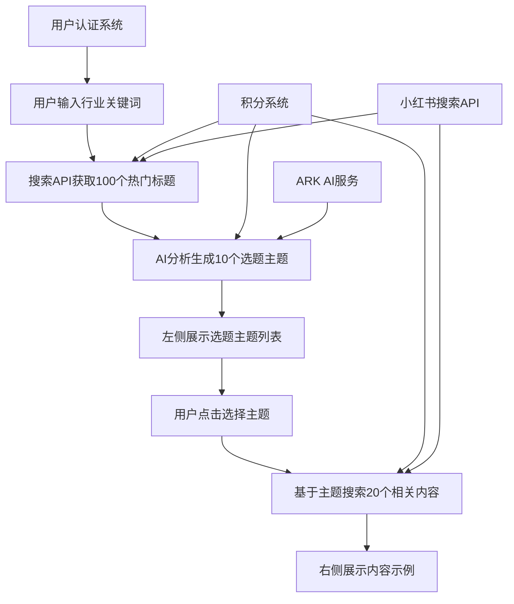

# 设计文档

## 概述

创作灵感功能是一个基于AI驱动的内容发现和分析系统，帮助小红书创作者通过行业关键词发现热门话题，并获得相关内容灵感。系统通过搜索热门内容、AI分析生成选题主题，再基于主题提供具体内容示例的三步流程，为创作者提供全面的创作指导。

## 架构

### 系统架构图



### 技术架构

- **前端**: Next.js 15 + React 19 + TypeScript + Tailwind CSS
- **后端**: Next.js API Routes + MySQL 8.0
- **外部服务**: Coze API (小红书搜索) + ARK API (AI分析)
- **认证**: JWT Token + Cookie认证
- **积分系统**: MySQL事务管理

## 组件和接口

### 前端组件结构

```
app/creative-inspiration/page.tsx
├── CreativeInspirationInterface (主界面组件)
│   ├── HeaderSection (顶部区域)
│   │   ├── IndustryInputSection (行业输入区域)
│   │   └── HistorySearchDropdown (历史搜索下拉菜单)
│   ├── TopicThemesSidebar (左侧选题主题列表)
│   └── ContentExamplesPanel (右侧内容示例面板)
└── 共享组件
    ├── LoadingSpinner (加载指示器)
    ├── ErrorMessage (错误提示)
    ├── NoteCard (内容卡片)
    └── HistorySearchItem (历史搜索项组件)
```

### API接口设计

#### 1. 创作灵感分析接口
```typescript
POST /api/creative-inspiration/analyze
Request: {
  industry: string // 行业关键词
}
Response: {
  success: boolean
  data?: {
    topics: Array<{
      id: string
      title: string
      description: string
      keywords: string[]
    }>
    searchResults: XiaohongshuNote[] // 原始搜索结果
  }
  error?: string
}
```

#### 2. 主题内容获取接口
```typescript
POST /api/creative-inspiration/content
Request: {
  topic: string // 选题主题关键词
  limit?: number // 默认20
}
Response: {
  success: boolean
  data?: {
    contents: Note[] // 相关内容列表
    total: number
  }
  error?: string
}
```

#### 3. 历史搜索记录接口
```typescript
GET /api/creative-inspiration/history
Request: {
  limit?: number // 默认20
  offset?: number // 默认0
}
Response: {
  success: boolean
  data?: {
    sessions: Array<{
      id: string
      industry: string
      created_at: string
      topics_count: number
      status: string
    }>
    total: number
  }
  error?: string
}
```

#### 4. 获取历史会话详情接口
```typescript
GET /api/creative-inspiration/session/{sessionId}
Response: {
  success: boolean
  data?: {
    session: {
      id: string
      industry: string
      created_at: string
      status: string
    }
    topics: Array<{
      id: string
      title: string
      description: string
      keywords: string[]
      popularity_score: number
    }>
  }
  error?: string
}
```

### 数据模型

#### 选题主题模型
```typescript
interface TopicTheme {
  id: string
  title: string // 主题标题
  description: string // 主题描述
  keywords: string[] // 相关关键词
  popularity: number // 热度评分
  contentCount: number // 相关内容数量
}
```

#### 创作灵感会话模型
```typescript
interface CreativeInspirationSession {
  id: string
  user_id: string
  industry: string // 输入的行业关键词
  topics: TopicTheme[] // 生成的选题主题
  selected_topic?: string // 当前选中的主题
  search_results: XiaohongshuNote[] // 原始搜索结果
  created_at: string
  updated_at: string
}
```

## 数据模型

### 数据库表设计

需要持久化存储用户的搜索历史和生成的选题，方便用户查看历史记录和复用选题：

```sql
-- 创作灵感会话表
CREATE TABLE creative_inspiration_sessions (
  id VARCHAR(36) PRIMARY KEY,
  user_id VARCHAR(36) NOT NULL,
  industry VARCHAR(255) NOT NULL,
  search_results_count INT DEFAULT 0,
  credits_consumed INT DEFAULT 0,
  status ENUM('analyzing', 'completed', 'failed') DEFAULT 'analyzing',
  error_message TEXT NULL,
  created_at TIMESTAMP DEFAULT CURRENT_TIMESTAMP,
  updated_at TIMESTAMP DEFAULT CURRENT_TIMESTAMP ON UPDATE CURRENT_TIMESTAMP,
  INDEX idx_user_created (user_id, created_at),
  INDEX idx_status (status)
);

-- 生成的选题主题表
CREATE TABLE creative_inspiration_topics (
  id VARCHAR(36) PRIMARY KEY,
  session_id VARCHAR(36) NOT NULL,
  title VARCHAR(255) NOT NULL,
  description TEXT,
  keywords JSON,
  popularity_score INT DEFAULT 0,
  sort_order INT DEFAULT 0,
  created_at TIMESTAMP DEFAULT CURRENT_TIMESTAMP,
  FOREIGN KEY (session_id) REFERENCES creative_inspiration_sessions(id) ON DELETE CASCADE,
  INDEX idx_session_id (session_id),
  INDEX idx_sort_order (session_id, sort_order)
);
```

### 内存数据结构

使用Redis或内存缓存存储临时会话数据：

```typescript
// 会话缓存结构
interface SessionCache {
  [sessionId: string]: {
    industry: string
    searchResults: XiaohongshuNote[]
    topics: TopicTheme[]
    selectedTopic?: string
    contentCache: {
      [topicId: string]: Note[]
    }
    expiresAt: number
  }
}
```

## 错误处理

### 错误类型定义

```typescript
enum CreativeInspirationError {
  INVALID_INPUT = 'INVALID_INPUT',
  SEARCH_API_ERROR = 'SEARCH_API_ERROR',
  AI_ANALYSIS_ERROR = 'AI_ANALYSIS_ERROR',
  INSUFFICIENT_CREDITS = 'INSUFFICIENT_CREDITS',
  AUTHENTICATION_ERROR = 'AUTHENTICATION_ERROR',
  RATE_LIMIT_EXCEEDED = 'RATE_LIMIT_EXCEEDED'
}
```

### 错误处理策略

1. **输入验证错误**: 前端实时验证，后端二次验证
2. **API调用错误**: 重试机制 + 降级处理
3. **AI分析错误**: 提供默认主题 + 错误提示
4. **积分不足**: 引导用户充值或升级会员
5. **认证错误**: 重定向到登录页面

### 重试机制

```typescript
const retryConfig = {
  searchAPI: { maxRetries: 3, delay: 1000 },
  aiAnalysis: { maxRetries: 2, delay: 2000 },
  contentSearch: { maxRetries: 3, delay: 1000 }
}
```

## 测试策略

### 单元测试

1. **API接口测试**
   - 输入验证测试
   - 响应格式测试
   - 错误处理测试

2. **组件测试**
   - 用户交互测试
   - 状态管理测试
   - 渲染逻辑测试

3. **业务逻辑测试**
   - AI分析结果处理
   - 积分消耗计算
   - 缓存机制测试

### 集成测试

1. **端到端流程测试**
   - 完整用户流程测试
   - 多用户并发测试
   - 错误恢复测试

2. **外部服务集成测试**
   - Coze API集成测试
   - ARK API集成测试
   - 认证系统集成测试

### 性能测试

1. **响应时间测试**
   - API响应时间 < 5秒
   - AI分析时间 < 10秒
   - 内容加载时间 < 3秒

2. **并发测试**
   - 支持100个并发用户
   - 数据库连接池测试
   - 缓存性能测试

## 实现细节

### AI分析Prompt设计

```typescript
const analysisPrompt = `
你是一个专业的小红书内容分析师。请分析以下100个关于"${industry}"行业的热门标题，总结出10个最具潜力的选题主题。

要求：
1. 每个主题要有明确的标题和描述
2. 提取相关关键词
3. 按热度和创作潜力排序
4. 确保主题之间有差异性
5. 适合小红书平台特点

标题列表：
${titles.join('\n')}

请以JSON格式返回结果：
{
  "topics": [
    {
      "title": "主题标题",
      "description": "主题描述",
      "keywords": ["关键词1", "关键词2"],
      "popularity": 85
    }
  ]
}
`;
```

### 缓存策略

1. **搜索结果缓存**: 30分钟
2. **AI分析结果缓存**: 2小时
3. **内容示例缓存**: 15分钟
4. **用户会话缓存**: 1小时

### 积分消耗规则

- 行业分析（搜索100个标题 + AI分析）: 5积分
- 主题内容获取（每次20个内容）: 2积分
- 失败重试不消耗积分

### 性能优化

1. **并行处理**: 搜索和AI分析可以并行进行
2. **分页加载**: 内容示例支持分页加载
3. **图片懒加载**: 内容封面图片懒加载
4. **请求去重**: 相同请求在短时间内去重

## 安全考虑

### 输入验证

```typescript
const industryValidation = {
  minLength: 2,
  maxLength: 50,
  allowedChars: /^[\u4e00-\u9fa5a-zA-Z0-9\s]+$/,
  forbiddenWords: ['测试', 'test', 'admin']
}
```

### 速率限制

- 每用户每分钟最多5次分析请求
- 每用户每分钟最多20次内容获取请求
- IP级别的全局速率限制

### 数据安全

- 用户输入内容过滤和清理
- API响应数据验证
- 敏感信息脱敏处理

## 监控和日志

### 关键指标监控

1. **业务指标**
   - 分析成功率
   - 平均响应时间
   - 用户满意度

2. **技术指标**
   - API调用成功率
   - 错误率分布
   - 系统资源使用率

### 日志记录

```typescript
const logEvents = {
  ANALYSIS_START: '开始行业分析',
  SEARCH_COMPLETE: '搜索完成',
  AI_ANALYSIS_COMPLETE: 'AI分析完成',
  CONTENT_FETCH_COMPLETE: '内容获取完成',
  ERROR_OCCURRED: '发生错误',
  CREDITS_CONSUMED: '积分消耗'
}
```

## 部署和运维

### 环境配置

创作灵感功能复用现有系统的环境配置，无需额外配置：

- **Coze API**: 使用现有的 `COZE_API_TOKEN` 和 `COZE_SEARCH_WORKFLOW_ID`
- **ARK API**: 使用现有的 `ARK_API_KEY` 和 `ARK_API_URL`
- **数据库**: 使用现有的 MySQL 连接配置
- **认证系统**: 使用现有的 JWT 认证机制

功能特定的可选配置可通过代码常量设置：
```typescript
const CREATIVE_INSPIRATION_CONFIG = {
  CACHE_TTL: 3600, // 缓存时间（秒）
  MAX_RETRIES: 3, // 最大重试次数
  SEARCH_LIMIT: 100, // 搜索结果数量
  TOPICS_COUNT: 10, // 生成选题数量
  CONTENT_LIMIT: 20 // 内容示例数量
}
```

### 扩展性考虑

1. **水平扩展**: 支持多实例部署
2. **缓存扩展**: 支持Redis集群
3. **数据库扩展**: 支持读写分离
4. **CDN加速**: 静态资源CDN加速