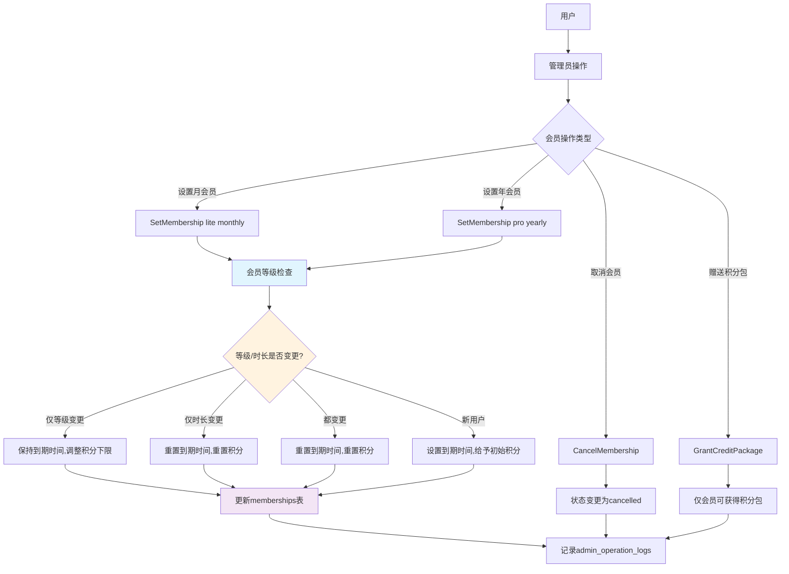
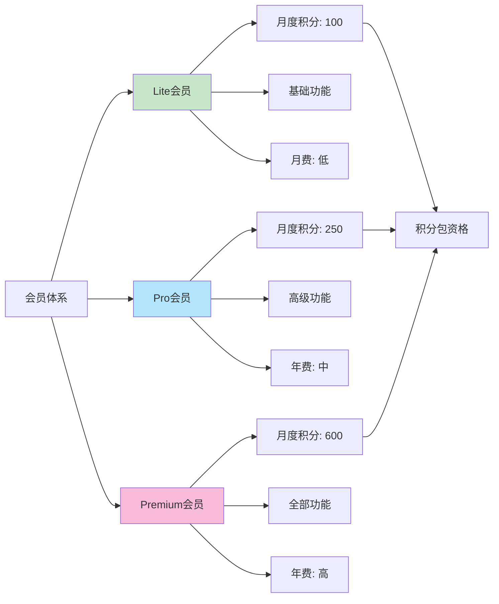
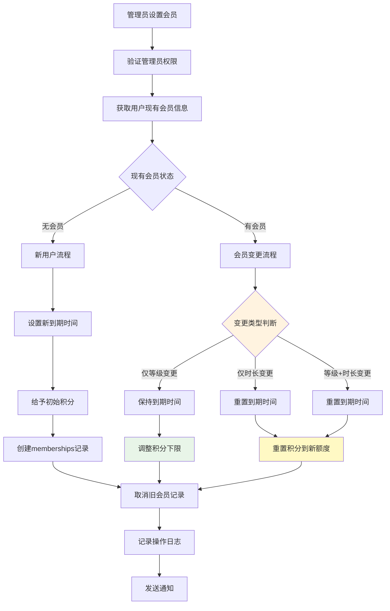
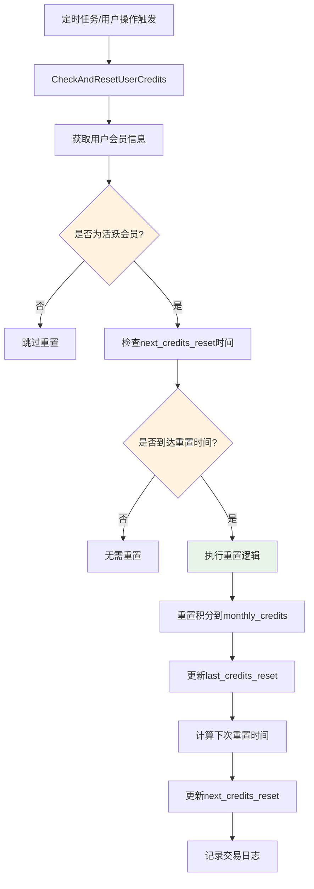
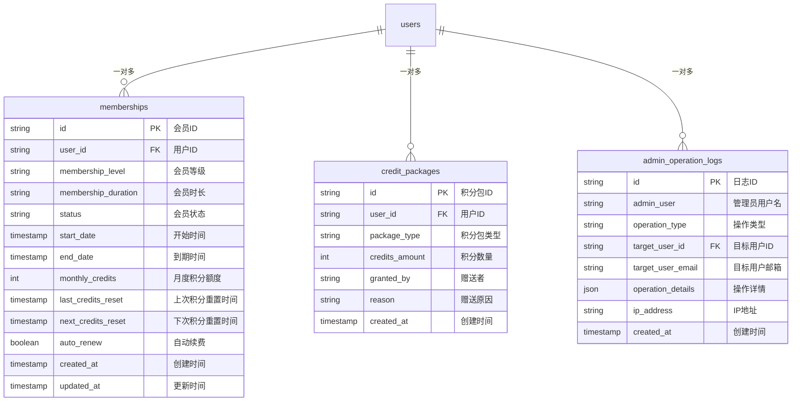
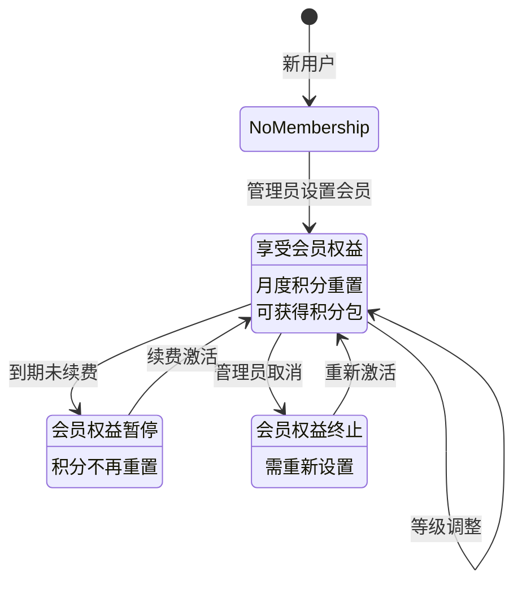
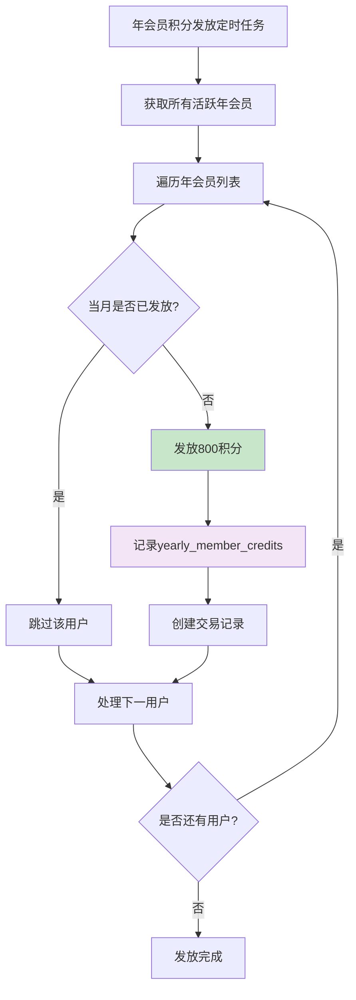
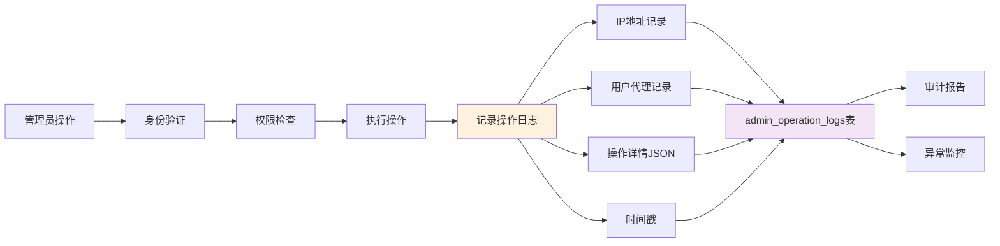

# 会员系统架构图

## 1. 会员系统总体架构

## 2. 会员等级和权益体系

## 3. 会员设置逻辑流程

## 4. 会员积分重置机制

## 5. 会员数据库设计

## 6. 会员状态管理

## 7. 年会员特殊积分发放

## 8. 管理员操作审计

## 关键代码路径

### 会员设置关键函数
- `SetMembership` 存储过程 in 015_improve_membership_logic.sql:20
- `AdminSetMembership()` in lib/mysql.ts
- `/api/admin/operations/set-membership/route.ts`

### 会员状态查询
- `getUserMembershipStatus()` in lib/mysql.ts:1931
- `user_membership_status` 视图
- `/api/membership/status/route.ts`

### 积分重置机制
- `CheckAndResetUserCredits` 存储过程
- `checkAndResetUserCredits()` in lib/mysql.ts
- `/api/credits/check-reset/route.ts`