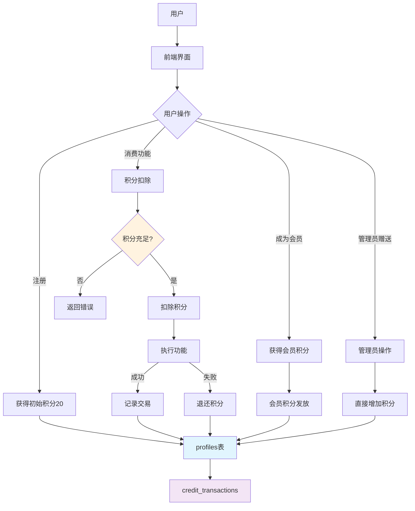
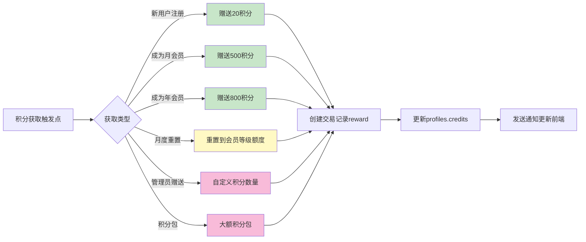
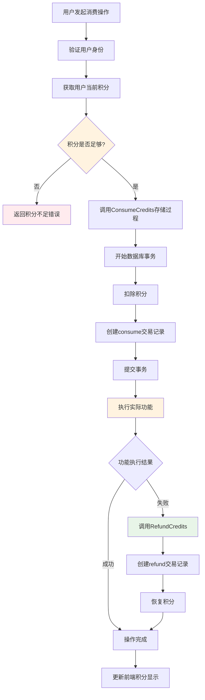
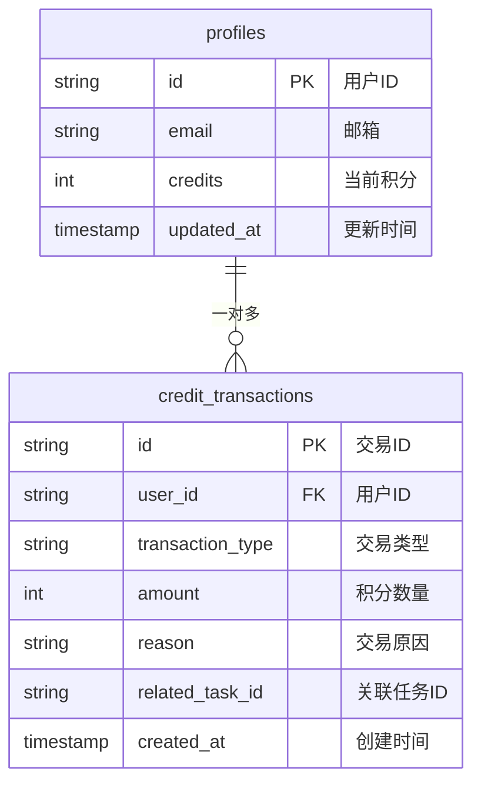
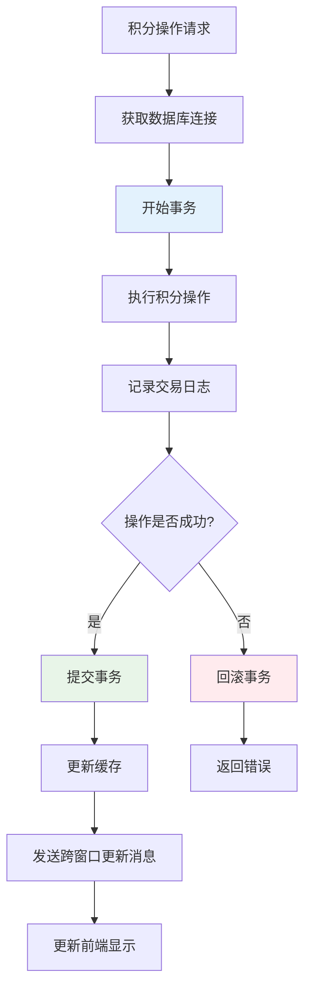
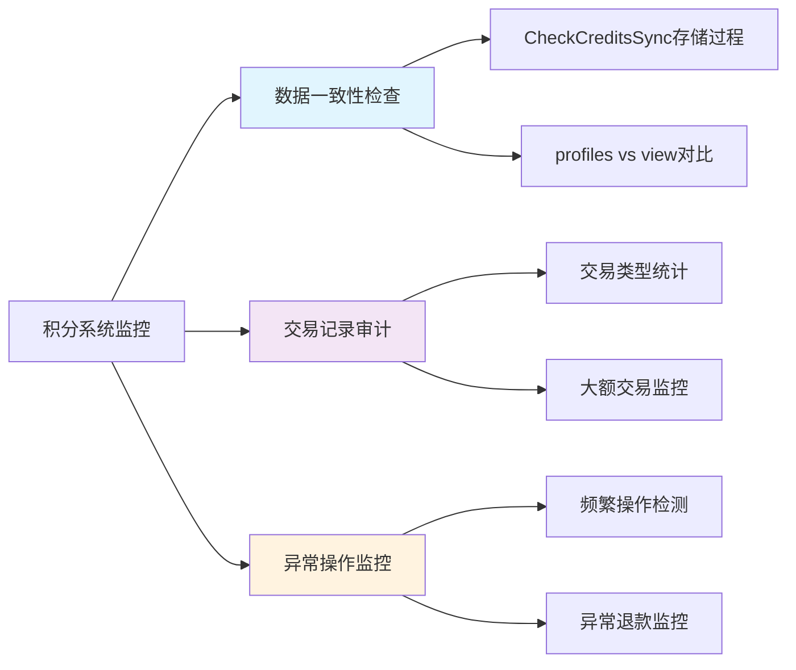

# 积分系统架构图

## 1. 积分系统总体架构

## 2. 积分获取流程

## 3. 积分消费流程

## 4. 积分交易记录结构

## 5. 积分一致性保障机制

## 6. 积分系统监控点

## 关键代码路径

### 积分扣除关键函数
- `consumeCredits()` in lib/mysql.ts:1234
- `ConsumeCredits` 存储过程 in 001_create_database_schema.sql:279

### 积分查询关键函数  
- `getProfile()` in lib/mysql.ts
- `/api/credits/balance/route.ts` API端点

### 前端积分管理
- `CreditsContext` in components/credits-context.tsx
- 跨窗口同步机制
- 缓存策略（5分钟TTL）