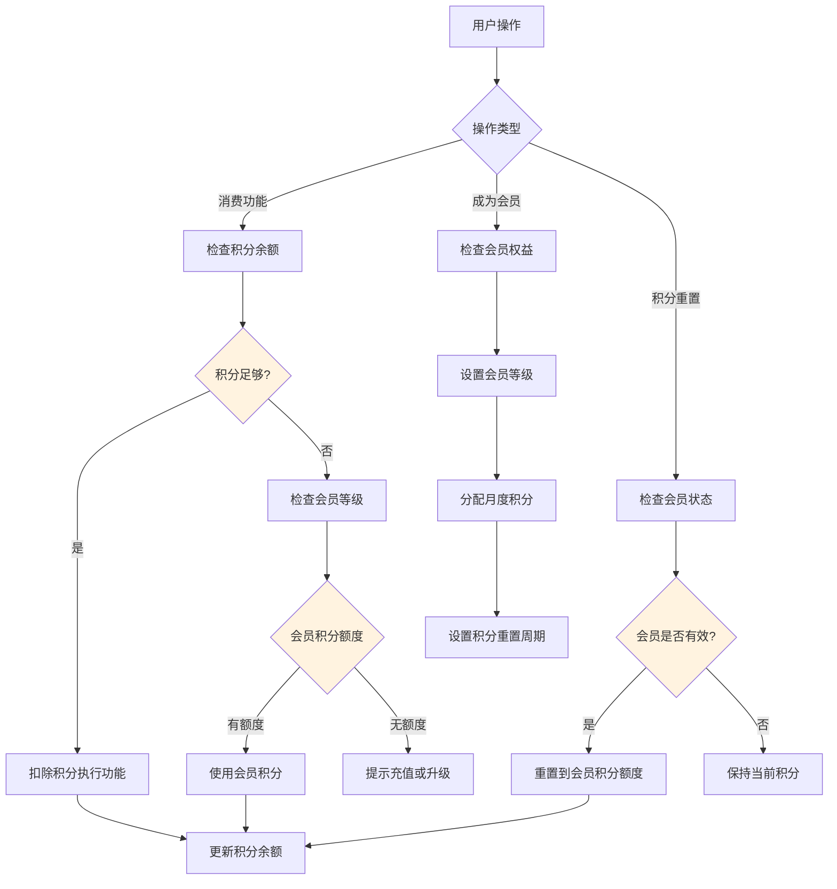
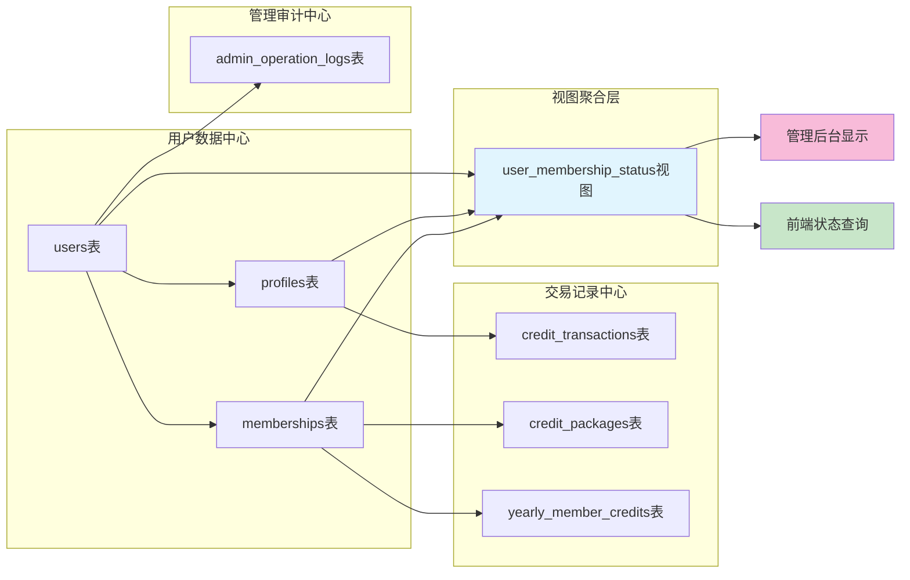
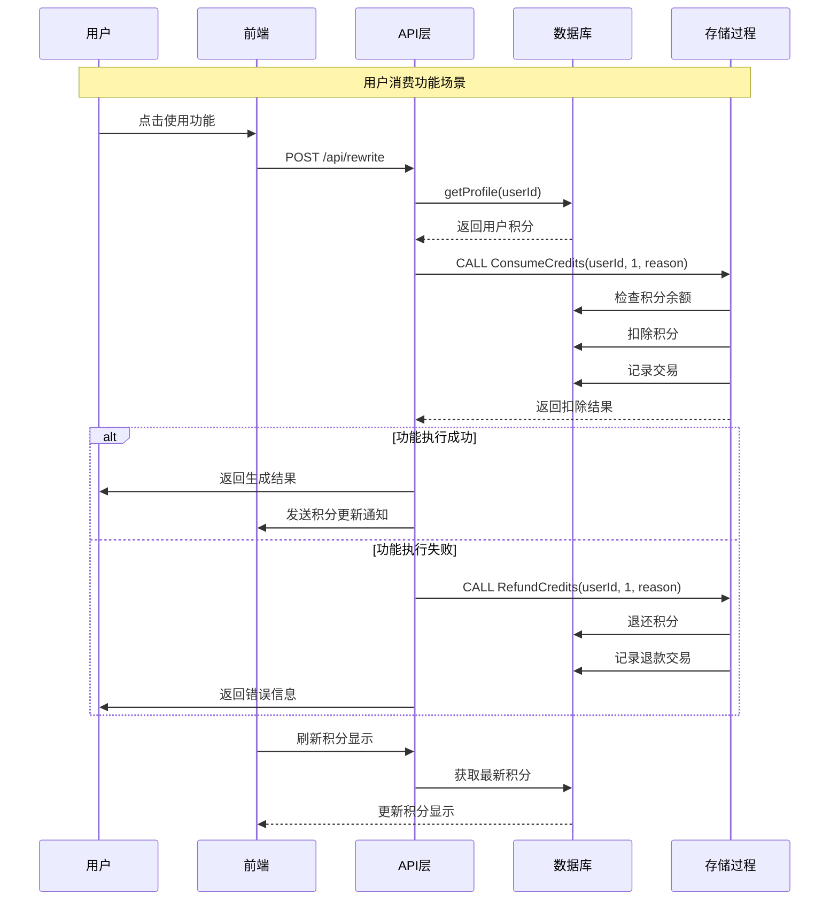
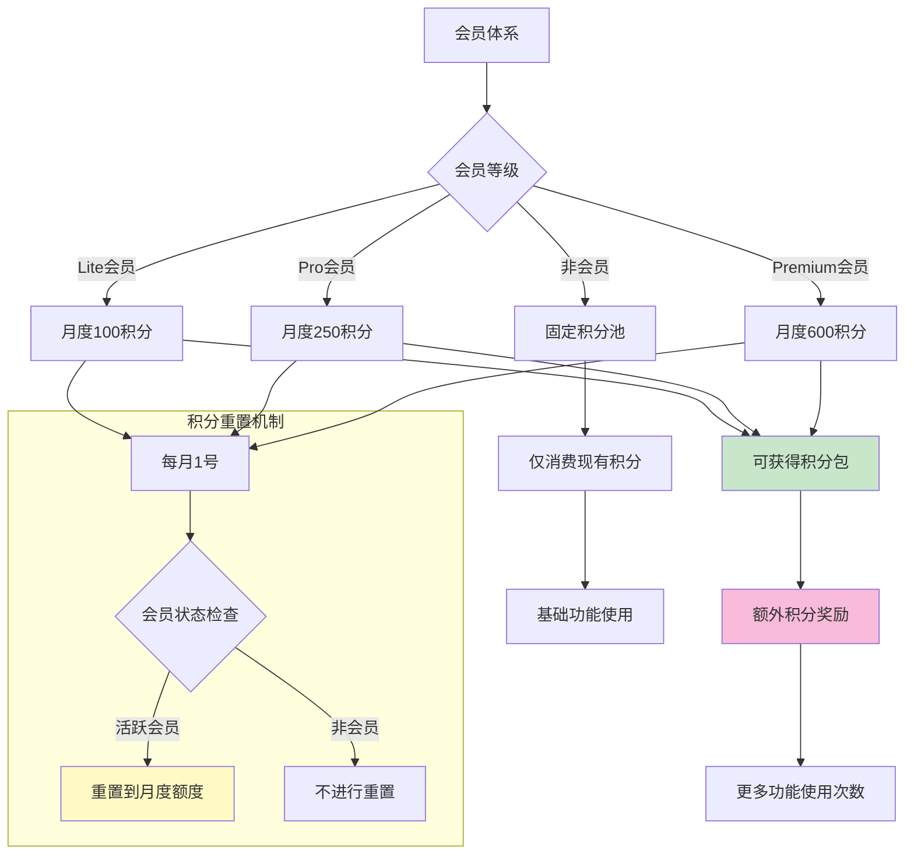
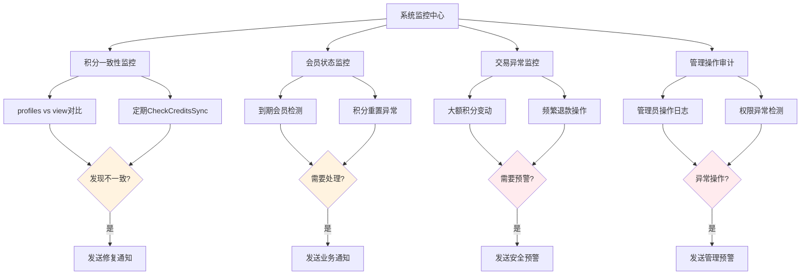
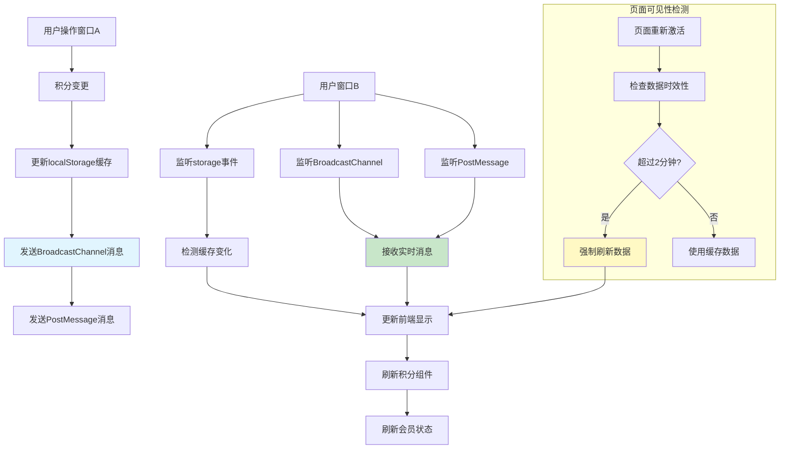

# 积分系统与会员系统交互关系图

## 1. 系统整体交互架构

```mermaid
graph TB
    subgraph "前端系统"
        A[用户界面] --> B[CreditsContext]
        A --> C[MembershipInfo]
        B --> D[积分显示组件]
        C --> E[会员状态组件]
    end
    
    subgraph "API层"
        F[/api/credits/*] --> G[积分相关API]
        H[/api/membership/*] --> I[会员相关API]
        J[/api/admin/*] --> K[管理后台API]
    end
    
    subgraph "业务逻辑层"
        L[lib/mysql.ts] --> M[积分操作函数]
        L --> N[会员操作函数]
        L --> O[数据库连接管理]
    end
    
    subgraph "数据库层"
        P[(profiles表)] --> Q[用户积分存储]
        R[(memberships表)] --> S[会员信息存储]
        T[(credit_transactions表)] --> U[积分交易记录]
        V[(admin_operation_logs表)] --> W[管理操作审计]
    end
    
    subgraph "存储过程层"
        X[ConsumeCredits] --> Y[积分扣除逻辑]
        Z[SetMembership] --> AA[会员设置逻辑]
        BB[GrantCredits] --> CC[积分赠送逻辑]
        DD[CheckAndResetUserCredits] --> EE[积分重置逻辑]
    end
    
    A --> F
    A --> H
    A --> J
    
    G --> M
    I --> N
    K --> N
    K --> M
    
    M --> X
    M --> BB
    M --> DD
    N --> Z
    
    Y --> P
    Y --> T
    CC --> P
    CC --> T
    EE --> P
    EE --> R
    AA --> R
    AA --> P
    AA --> V
    
    style A fill:#e3f2fd
    style L fill:#f3e5f5
    style P fill:#e8f5e8
    style X fill:#fff3e0
```

## 2. 积分与会员权益联动机制



## 3. 数据流转关系



## 4. 关键业务流程交互



## 5. 会员权益与积分额度关系



## 6. 系统监控与预警机制



## 7. 跨窗口数据同步机制



## 关键技术实现点

### 数据一致性保障
- 数据库事务确保ACID特性
- 存储过程封装复杂业务逻辑
- 定期数据一致性检查

### 前端状态管理
- React Context统一积分状态
- 5分钟缓存策略减少API调用
- 跨窗口实时同步机制

### 安全性保障
- JWT身份验证
- 管理员操作审计日志
- IP地址和User-Agent记录

### 性能优化
- 连接池管理数据库连接
- 视图优化查询性能  
- 缓存策略减少数据库压力